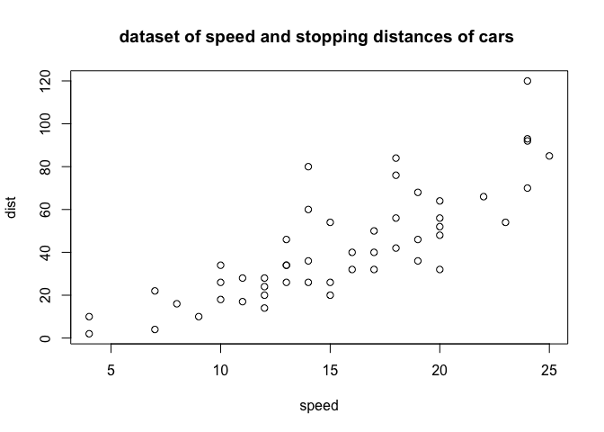

[](https://travis-ci.org/mandpd/comments)
[](https://ci.appveyor.com/project/mandpd/comments)
[](https://codecov.io/github/mandpd/comments?branch=master)

<!-- README.md is generated from README.Rmd. Please edit that file -->

# comments

This package allows you to add an attribute to your R objects that can
be used to store comments. It provides a set of functions to list, add,
and delete comments. In addition, text categories can be associated with
comments. There is a special category of ‘todo’ comments which have
their own functions to list, add, and delete them.

## Installation

You can install the released version of comments from
[github](https://github.com/mandpd/comments) with:

library(devtools)

install\_github(“mandpd/comments”)

## Example

The comments package allows you to add comments to your data sets as you
manipulate them, e.g. during your exploratory data analysis phase. To
enable a data set to contain comments, first apply the enotes() function
to it. You can optionally add an intial comment, e.g. a summary of the
contents of the dataset, or the source of the dataset. Additional notes
can be added using anote()

### enotes() - enable an R object to have notes

``` r
library(comments)
df <- enotes(cars, 'dataset of speed and stopping distances of cars')
df <- anote(df, 'from base package') 
```

This enables the use of anote(), dnote(), notes(), and rnotes() with the
cars data.frame

### notes() - list the notes attached to an R object

``` r
notes(df)
#> #    Comments                                                       
#> ----------------------------------------------------------------------
#> 1 :  dataset of speed and stopping distances of cars                  
#> 2 :  from base package
```

You can also extract a specific note by providing a column vector of
comment ids

``` r
notes(df,2)
#> #    Comments                                                       
#> ----------------------------------------------------------------------
#> 2 :  from base package
```

### rnotes() - retrieve the raw notes matrix object

This can be useful if you want to use the text from a specific comment,
for example in the title of a plot

``` r
plot(df, main = rnotes(df)[1,2][[1]])
```



### anote() - add a new note to the list attached to an R object

Let’s rescale the values in the speed and distance columns to be between
0 and 1, add notes explaining this, and then print out the notes. An
individual comment can contain a maximum of 66 characters. If your
comment needs to be longer, use the anote function multiple times.

``` r
rescale_param <- function(x) { (x-min(x)) / (max(x)- min(x))}
df[] <- lapply(df, rescale_param)
df <- anote(df, 'rescaled speed to between 0 and 1')
df <- anote(df, 'rescaled distance to between 0 and 1')
notes(df)
#> #    Comments                                                       
#> ----------------------------------------------------------------------
#> 1 :  dataset of speed and stopping distances of cars                  
#> 2 :  from base package                                                
#> 3 :  rescaled speed to between 0 and 1                                
#> 4 :  rescaled distance to between 0 and 1
```

### Use with dplyr package

These comments will follow any operations performed on the object, and
can be used in conjunction with dplyr pipes (%\>%) which provides a fast
way to add notes as you proceed

``` r
library(dplyr)
df2 <- enotes(cars, 'dataset of speed and stopping distances of cars')
df3 <- df2 %>% 
  anote('added a time variable based on dist / speed') %>%
  mutate(time = dist / speed) %>%
  anote('filtered out dist variable') %>%
  select(-dist)
notes(df3)
#> #    Comments                                                       
#> ----------------------------------------------------------------------
#> 1 :  dataset of speed and stopping distances of cars                  
#> 2 :  added a time variable based on dist / speed                      
#> 3 :  filtered out dist variable
```

``` r
glimpse(df3)
#> Observations: 50
#> Variables: 2
#> $ speed <dbl> 4, 4, 7, 7, 8, 9, 10, 10, 10, 11, 11, 12, 12, 12, 12, 13, …
#> $ time  <dbl> 0.5000000, 2.5000000, 0.5714286, 3.1428571, 2.0000000, 1.1…
```

### dnote() - delete a note from the list of notes attached to an R object

You can selectively remove comments using the comment id

``` r
df3 <- dnote(df3,1,confirm = FALSE)
notes(df3)
#> #    Comments                                                       
#> ----------------------------------------------------------------------
#> 1 :  added a time variable based on dist / speed                      
#> 2 :  filtered out dist variable
```

### summary function

Data frames with the commented class will include any comments when
summary is run

``` r
summary(df3)
#> #    Comments                                                       Time Stamp       
#> --------------------------------------------------------------------------------------------
#> 1 :  added a time variable based on dist / speed                    04/06/2019 11:35   
#> 2 :  filtered out dist variable                                     04/06/2019 11:35
#>      speed           time      
#>  Min.   : 4.0   Min.   :0.500  
#>  1st Qu.:12.0   1st Qu.:1.921  
#>  Median :15.0   Median :2.523  
#>  Mean   :15.4   Mean   :2.632  
#>  3rd Qu.:19.0   3rd Qu.:3.186  
#>  Max.   :25.0   Max.   :5.714
```

### print function

R objects with the commented class will include any comments when print
is run with the ‘notes’ parameter set to TRUE

``` r
print(df3[1:5,], notes = T)
#> #    Comments                                                       Time Stamp       
#> --------------------------------------------------------------------------------------------
#> 1 :  added a time variable based on dist / speed                    04/06/2019 11:35   
#> 2 :  filtered out dist variable                                     04/06/2019 11:35   
#> 
#>   speed      time
#> 1     4 0.5000000
#> 2     4 2.5000000
#> 3     7 0.5714286
#> 4     7 3.1428571
#> 5     8 2.0000000
```

### timestamps

All notes are entered with a timestamp. You can use the ‘showtimestamps’
parameter to see these

``` r
notes(df3, showtimestamps = T)
#> #    Comments                                                       Time Stamp       
#> --------------------------------------------------------------------------------------------
#> 1 :  added a time variable based on dist / speed                    04/06/2019 11:35   
#> 2 :  filtered out dist variable                                     04/06/2019 11:35
```

### categories

All notes are entered with a category. This is a text tag of up to 10
characters that can be attached to a comment when it is first added. You
can use the ‘showcategories’ parameter to see these. By default, a
comment is tagged with ‘none’.

``` r
notes(df3, showcategories = T)
#> #    Comments                                                        Category
#> -------------------------------------------------------------------------------
#> 1 :  added a time variable based on dist / speed                     none      
#> 2 :  filtered out dist variable                                      none
```

You can override the default tag when adding a comment by setting the
‘category’ parameter to your tag value.

``` r
df3 <- anote(df3, 'the dist values appear skewed', category = 'review')
notes(df3, showcategories = T)
#> #    Comments                                                        Category
#> -------------------------------------------------------------------------------
#> 1 :  added a time variable based on dist / speed                     none      
#> 2 :  filtered out dist variable                                      none      
#> 3 :  the dist values appear skewed                                   review
```

### atodo() - add a new todo comment to the list of comments attached to an R object

Todo comments are designed to hold comments on additional tasks or
actions to be performed on an R object. An individual todo comment can
contain a maximum of 66 characters. If your todo comment needs to be
longer, use the atodo function multiple times.

``` r
df <- atodo(df, 'determine if dist is normally distributed')
```

### todos() - lists the todo comments attached to an R object

``` r
todos(df)
#> #    To Do                                                          
#> ----------------------------------------------------------------------
#> 5 :  determine if dist is normally distributed
```

### ‘showcategories’ parameter

Todo comments appear in the output of notes(). You can use the
showcategories parameter to identify which notes are todo notes

``` r
notes(df, showcategories = T)
#> #    Comments                                                        Category
#> -------------------------------------------------------------------------------
#> 1 :  dataset of speed and stopping distances of cars                 none      
#> 2 :  from base package                                               none      
#> 3 :  rescaled speed to between 0 and 1                               none      
#> 4 :  rescaled distance to between 0 and 1                            none      
#> 5 :  determine if dist is normally distributed                       todo
```

### dtodo() - delete a todo comment from the list of comments attached to an R object

You can selectively remove comments using the comment id

``` r
df <- dtodo(df,5,confirm = FALSE)
todos(df)
#> [1] "None"
```
